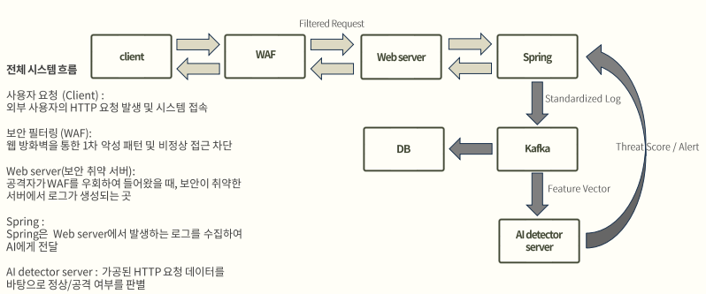

# AI 기반 보안 아키텍처 설계 및 구현

## 1. 프로젝트 소개

보안 로그를 Kafka 기반 스트리밍 파이프라인으로 수집하고, Spring Boot 백엔드와 FastAPI AI 서비스가 로그를 분석해 위협 이벤트를 탐지한 뒤 React 대시보드에서 시각화하는 졸업 프로젝트입니다.

이 프로젝트는 단순 기능 구현뿐 아니라 계층형 백엔드 구조, API 응답 DTO 분리, 요청 검증, 보안 분석 자동화, SBOM 생성까지 포트폴리오 관점의 코드 품질과 문서화를 함께 목표로 합니다.

## 2. 주요 기능

- WAF + Reverse Proxy 기반 외부 요청 필터링 및 라우팅 구조
- Kafka 기반 보안 로그 수집 및 비동기 처리
- FastAPI 기반 AI 추론 서비스 연동
- Spring Boot 백엔드의 로그, 위협, 블랙리스트 관리 API
- JWT 기반 관리자 인증
- MySQL 기반 로그 및 탐지 결과 저장
- React 대시보드에서 로그, 탐지 이벤트, 차단 IP 현황 표시
- WebSocket/STOMP 기반 실시간 알림 구조
- Swagger OpenAPI 문서 제공
- CodeQL, CycloneDX, OWASP Dependency-Check 기반 보안 품질 관리

## 시스템 아키텍처



## 기술 스택

| 영역 | 기술 |
| --- | --- |
| Backend | Java 17, Spring Boot 3.5, Spring Web, Spring Security, Spring Data JPA, Spring Kafka |
| AI Service | Python, FastAPI, scikit-learn 기반 모델 |
| Frontend | React, Axios, STOMP, SockJS |
| Database | MySQL |
| Message Broker | Apache Kafka |
| Infra | Docker, Docker Compose, Windows local development |
| Quality | Swagger OpenAPI, CodeQL, CycloneDX SBOM, OWASP Dependency-Check |

## 주요 구현 포인트

### 백엔드

#### Backend API 구조 개선
- Controller에서 Repository를 직접 호출하던 구조를 Service 계층 중심으로 정리했습니다.
- Entity를 API 응답으로 직접 노출하지 않고 Response DTO로 변환했습니다.
- @Valid 기반 요청 검증과 GlobalExceptionHandler 기반 공통 에러 응답을 추가했습니다.
- 목록 조회 API에 pagination과 최신순 정렬을 적용해 findAll() 기반 대량 조회 위험을 줄였습니다.

#### 인증 및 보안
- 관리자 로그인 성공 시 JWT를 발급합니다.
- Spring Security 기반으로 보호 API와 공개 API를 분리합니다.
- Swagger 접근 허용 경로를 명시하고, Spring Boot와 SpringDoc 버전 호환성 문제를 해결했습니다.

#### Kafka / AI 분석 흐름
- 로그 처리는 log-topic 기반 Kafka Consumer에서 시작됩니다.
- AI 분석 결과는 ai-result-topic을 통해 백엔드로 전달되는 흐름을 기준으로 설계했습니다.
- HTTP 기반 /api/v1/threats/detect는 AI 결과를 직접 수신하는 보조/테스트용 API로 구분했습니다.

#### 보안 품질 관리
- GitHub CodeQL로 정적 보안 분석을 수행합니다.
- CycloneDX Gradle Plugin으로 SBOM을 생성합니다.
- OWASP Dependency-Check로 오픈소스 의존성 취약점 분석을 수행합니다.
- NVD API Key는 코드에 저장하지 않고 환경변수로만 참조하도록 구성합니다.

### 프론트엔드
- 작성예정

### 보안

#### WAF / Reverse Proxy 구조

- 외부 사용자의 요청은 WAF를 먼저 통과하도록 설계했습니다.
- WAF는 비정상 요청 패턴을 필터링하고, 정상 요청만 Reverse Proxy로 전달합니다.
- Reverse Proxy는 요청 경로에 따라 React frontend와 Spring Boot backend로 트래픽을 라우팅합니다.
- 향후 TLS 종료, 접근 로그 수집, rate limiting, 보안 정책 적용 지점으로 확장할 수 있도록 앞단 게이트웨이 계층을 분리했습니다.

### AI
- 작성예정

#### 프로젝트 구조

```
├── backend/              # Spring Boot 백엔드
├── frontend/             # React 대시보드
├── AI/                   # FastAPI AI 분석 서비스
├── docs/                 # 설계 문서, 보안 점검 문서, 회의 기록
├── dev_tools/            # 테스트 도구 및 개발 보조 스크립트
├── waf/                  # WAF 관련 실험/문서
├── targets/              # 테스트 대상 또는 실험 리소스
└── .github/workflows/    # GitHub Actions, CodeQL workflow
```

## 로컬 실행 방법
아래 명령은 Windows PowerShell 기준입니다.

### Kafka/MySQL 실행
```
docker compose -f ./backend/docker-compose.yml up -d zookeeper kafka db
```

### WAF/JuicShop 실행
```
docker compose -f ./backend/docker-compose.yml up -d zookeeper kafka db
docker compose -f ./waf/docker-compose.yml -f ../targets/juiceshop/docker-compose.yml up -d
```

### Backend 실행
```
cd backend
.\gradlew bootRun
```

### Swagger UI:
```
http://localhost:8080/swagger-ui/index.html
```

### Frontend 실행
```
cd frontend
npm install
npm start
```

### React 개발 서버:
```
http://localhost:3000
```

### AI Service 실행
```
cd AI
python -m venv .venv
.\.venv\Scripts\activate
pip install -r requirements.txt
uvicorn main:app --reload
```

## 주요 API

| Method | Path | 설명 |
| --- | --- | --- |
| POST | `/api/v1/auth/login` | 관리자 로그인 및 JWT 발급 |
| POST | `/api/v1/auth/register` | 관리자 계정 생성, 테스트/개발용 |
| GET | `/api/v1/logs` | 로그 목록 조회, pagination 적용 |
| GET | `/api/v1/logs/search?ip=` | IP 기준 로그 검색 |
| GET | `/api/v1/blacklist` | 블랙리스트 목록 조회 |
| POST | `/api/v1/blacklist` | IP 차단 등록 |
| DELETE | `/api/v1/blacklist/{id}` | 블랙리스트 항목 삭제 |
| GET | `/api/v1/threats` | 탐지된 위협 목록 조회 |
| POST | `/api/v1/threats/detect` | AI 탐지 결과 HTTP 수신, 보조/테스트용 |

## 테스트 및 품질 점검

### Backend 테스트
```
cd backend
.\gradlew test
```

### Backend 컴파일 확인
```
cd backend
.\gradlew compileJava
```

### Gradle 의존성 확인
```
cd backend
.\gradlew dependencies --configuration runtimeClasspath
```

### SBOM 생성
```
cd backend
.\gradlew cyclonedxBom
```

생성 결과:
```
backend/build/reports/cyclonedx/bom.json
backend/build/reports/cyclonedx/bom.xml
```

### 오픈소스 취약점 분석
```
cd backend
$env:NVD_API_KEY="발급받은_NVD_API_KEY"
.\gradlew dependencyCheckAnalyze
```
NVD API Key는 필수는 아니지만, 없으면 취약점 DB 업데이트가 오래 걸릴 수 있습니다. API Key는 저장소에 커밋하지 않고 환경변수로만 관리합니다.